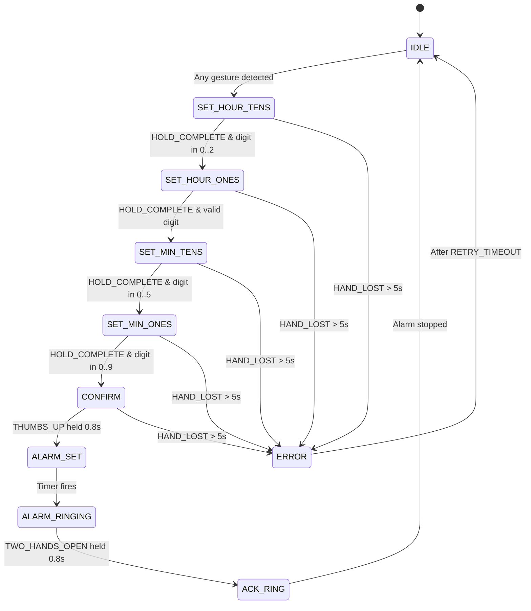

# FSM Specification

## State Diagram

## States

| State           | Description                                          |
| --------------- | ---------------------------------------------------- |
| `IDLE`          | Default state, no active flow, shows default overlay |
| `SET_HOUR_TENS` | Setting first digit of hours (0-2)                   |
| `SET_HOUR_ONES` | Setting second digit of hours (0-9, max 3 if tens=2) |
| `SET_MIN_TENS`  | Setting first digit of minutes (0-5)                 |
| `SET_MIN_ONES`  | Setting second digit of minutes (0-9)                |
| `CONFIRM`       | Awaiting thumbs-up confirmation                      |
| `ALARM_SET`     | Alarm scheduled, waiting to ring                     |
| `ALARM_RINGING` | Alarm is actively ringing                            |
| `ACK_RING`      | Alarm stop acknowledged                              |
| `ERROR`         | Detection failure, timeout recovery                  |

## Events

| Event             | Description                            |
| ----------------- | -------------------------------------- |
| `FINGER_COUNT(n)` | n fingers detected (0-5)               |
| `HOLD_COMPLETE`   | Gesture held for HOLD_SEC (2.0s)       |
| `SWIPE(dir)`      | Swipe detected (LEFT, RIGHT, UP, DOWN) |
| `THUMBS_UP`       | Thumbs-up gesture detected             |
| `TWO_HANDS_OPEN`  | Two hands with open palms detected     |
| `FIST`            | Closed fist (clear gesture)            |
| `HAND_LOST`       | No hands for HAND_LOST_TIMEOUT (5s)    |
| `TIME_TIMEOUT`    | General state timeout                  |

## Transition Table

| Current State | Event          | Guard                  | Action               | Next State      |
| ------------- | -------------- | ---------------------- | -------------------- | --------------- |
| IDLE          | Any gesture    | -                      | -                    | SET_HOUR_TENS   |
| SET_HOUR_TENS | HOLD_COMPLETE  | digit in 0..2          | commit_digit(digit)  | SET_HOUR_ONES   |
| SET_HOUR_ONES | HOLD_COMPLETE  | valid_for_hours(digit) | commit_digit(digit)  | SET_MIN_TENS    |
| SET_MIN_TENS  | HOLD_COMPLETE  | digit in 0..5          | commit_digit(digit)  | SET_MIN_ONES    |
| SET_MIN_ONES  | HOLD_COMPLETE  | digit in 0..9          | commit_digit(digit)  | CONFIRM         |
| CONFIRM       | THUMBS_UP      | confidence >= 0.85     | schedule_alarm()     | ALARM_SET       |
| ALARM_SET     | Timer fires    | -                      | start_ring()         | ALARM_RINGING   |
| ALARM_RINGING | TWO_HANDS_OPEN | held 0.8s              | stop_ring()          | ACK_RING        |
| ACK_RING      | -              | -                      | play_success_sound() | IDLE            |
| Any           | HAND_LOST      | timeout > 5s           | show_error()         | ERROR           |
| ERROR         | -              | after RETRY_TIMEOUT    | -                    | Previous stable |

## Digit Validation Rules

- **Hour Tens**: Only 0, 1, or 2 allowed
- **Hour Ones**:
  - If hour_tens = 2: only 0, 1, 2, 3 allowed (max 23:xx)
  - Otherwise: 0-9 allowed
- **Minute Tens**: Only 0-5 allowed
- **Minute Ones**: 0-9 allowed
